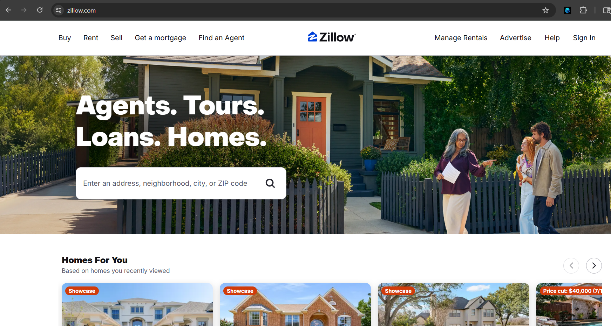
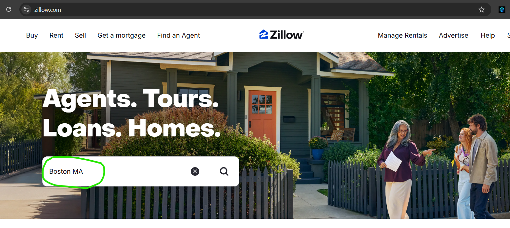
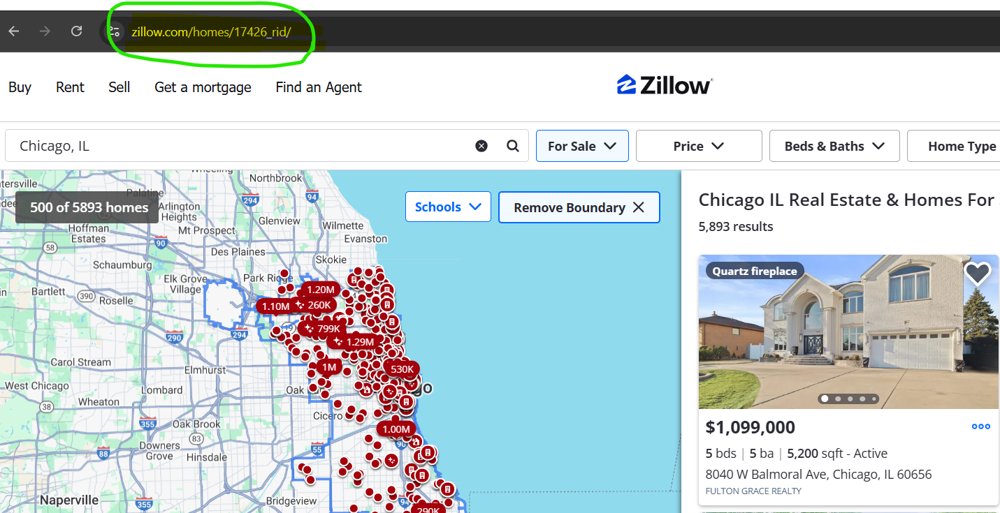
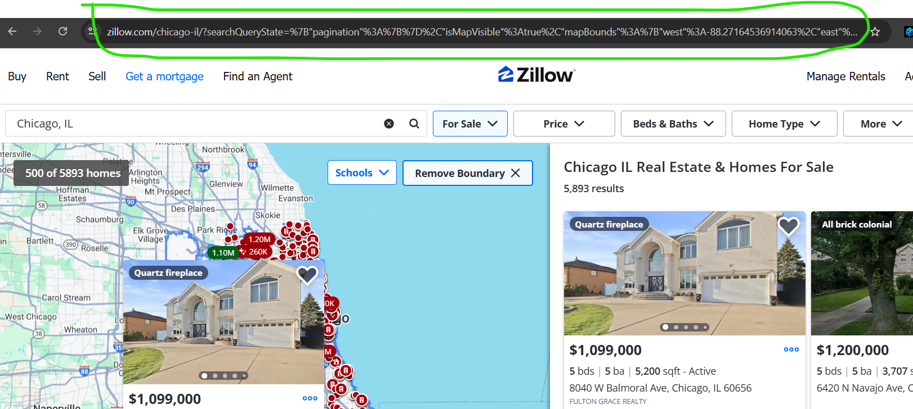
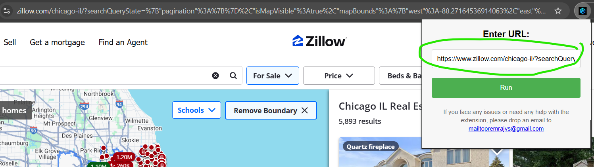
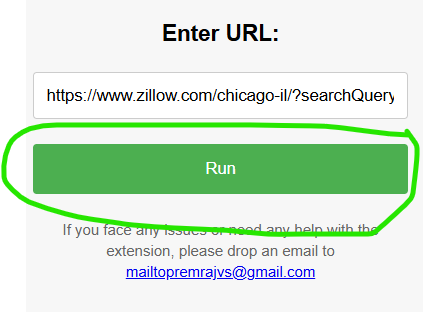

# Zillow Data Exporter - Chrome Extension

This extension allows you to export property search results from Zillow.com into a CSV file.

## How to Use

1.  Open your Chrome browser and navigate to [Zillow.com](https://www.zillow.com).

    

2.  Type what you want to search and wait for the search results to load fully.

    

3.  **Important First-Time Step:** Sometimes, on the browser you will not see the complete URL. Screenshot below
    
    To fix this, Click on any one of the listings from the search results.
    This step is only required if you do not see the long URL in the browser.

    

4.  After viewing the listing, close it to return to the search results page. Copy the complete URL from your browser's address bar.

    

5.  Click on the Zillow Data Exporter extension icon in your Chrome toolbar, paste the copied URL into the input field, and click the "Run" button to start the export.

    

## Support

If you face any issues or need any help with the extension, please drop an email to [mailtopremrajvs@gmail.com](mailto:mailtopremrajvs@gmail.com).
